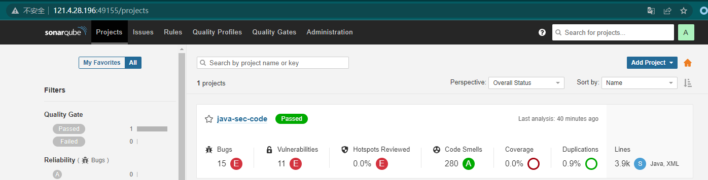

# 静态代码分析器（SAST） - 预研版
- https://blog.csdn.net/ch98000/article/details/126664737
- https://zhuanlan.zhihu.com/p/371668441

## sonarqube
- https://zhuanlan.zhihu.com/p/544429607
- [ref](https://github.com/docker-library/docs/tree/master/sonarqube)


  
```bash

docker run -itd --name=sonarqube -P \
  -v /srv/sonarqube/data:/opt/sonarqube/data \
  -v /srv/sonarqube/logs:/opt/sonarqube/logs \
  -v /srv/sonarqube/extensions:/opt/sonarqube/extensions \
  sonarqube:8.9.10-community
```

## codeql (Recoment-推荐)
- https://zhuanlan.zhihu.com/p/479431942
- 进阶编写和分析-[xxe示例]](https://www.jianshu.com/p/27cba18b9276)
- 效果是编写的规则都比较严密，适合0day挖掘，漏报率高。
- https://docs.github.com/zh/enterprise-server@3.3/code-security/guides
 - https://www.wangan.com/p/7fy7fg448fb3b026


## semgrep
> dsl 编程；类似之前的 `cobra`
- https://semgrep.dev/explore
- https://github.com/returntocorp/semgrep-rules
- https://zhuanlan.zhihu.com/p/564405681

## fortify
- 有商业版app，只能绑定20个项目； 开源版是cli。 
- 效果是漏报率低，但是精确度低。
  - https://zhuanlan.zhihu.com/p/164586861
    
Fortify是一款强大的静态代码扫描分析工具，其发现代码漏洞缺陷的能力十分强悍，主要是将代码经过编译，依托于其强大的内置规则库来发现漏洞的。其次fortify SCA团队在开发此商业工具时，也提供了自定义规则的接口，只要经过正版授权后，便可以在此基础上自定义规则，来增强Fortify SCA的漏洞识别能力，同时经过自定义规则，也可以降低误报，使静态分析的准确度和高效性。
默认情况下，Fortify SCA使用安装的安全编码规则包来检查源代码，并定义一系列可能出现的问题，如可被攻击者李勇的安全漏洞和不良的编码缺陷。
安全编码规则中的规则分析受支持语言的核心和扩展的API包中的函数，并将分析结果记录在Fortify SCA中。每一个问题的解释包含了对问题的描述和建议的解决方案，一边更好的解决程序中的漏洞和缺陷。也可以通过创建自定义规则包来准确地分析特定的应用程序，验证专门的安全规则以及细化Fortify SCA所报告的问题。
